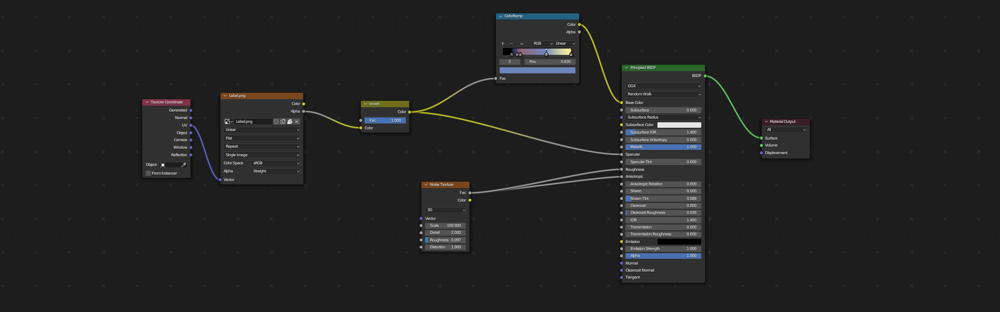
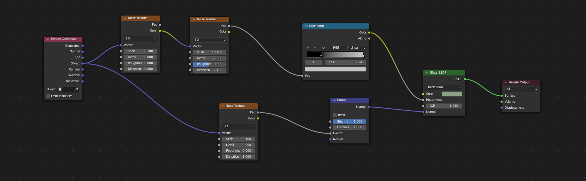
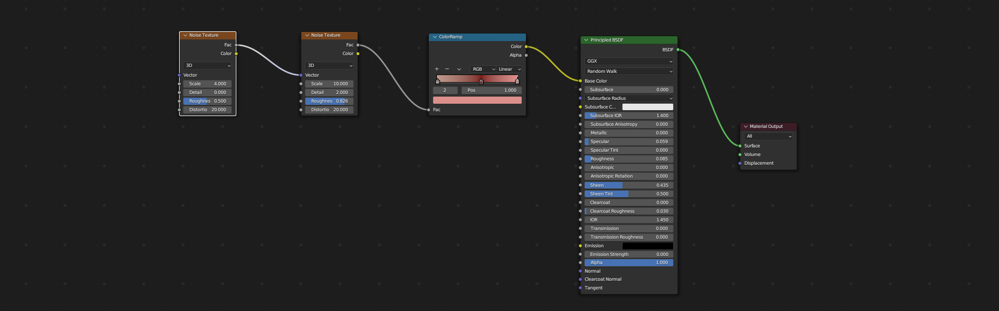

# Session #4 

## Texturing Workshop Session

We will focus on creating, customizing, and applying procedural textures. Furthermore, we will explore the use of simple mapped image textures to understand how they work. After covering texturing, we will proceed to set up the scene to create a visually appealing rendering.

## Comparing Procedural and Mapped Textures 

### Procedurally Generated Textures:

* Instant Tweaks
* Can be animated 
* Generally take up less space
* Can be Tedious

### Mapped Textures (UV or Projected)

* Render efficiently
* Transport between applications
* Offers more control
* More widely used

## Setting up our workspace for texturing

* Window splits
* Changing workspaces
* Downloading resource files
* Creating blank textures

## Building our first procedural texture 

We will start building our first procedural texture for our red dipped wax.

## Building our second procedural texture in combination with our first mapped texture

## Building our third procedural texture 

## Building our fourth procedural texture

## Building our fifth and final procedural texture

## Setting up our camera (15)

## Setting up our Focus Object (15)

## Setting scene (15)

## Rendering out our project (15)

# Downloads

## [Download Wine Bottle Blender File](dl/WineBottle/WineBottle.blend)
## [Download Image of Wine Bottle Wireframe](dl/WineBottle/WineBottleWire.png)
## [Download Image of final render example](dl/WineBottle/WineBottleRender.png)
## [Download Label Image](dl/WineBottle/Label.png)
## [Download Blender Logo](dl/WineBottle/BlenderLogo.png)
